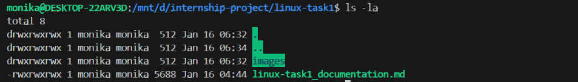

# Linux Task 1 - Command Log

## 1. Navigation Commands

### Print Working Directory
```bash
$ pwd
```
**Output:**
```
/mnt/d/internship-project
```

### List Directory Contents
```bash
$ ls -la
```
**Output:**
```
total 56
drwxr-xr-x 5 username username 4096 Jan 16 09:00 .
drwxr-xr-x 3 root     root     4096 Jan 16 08:00 ..
-rw------- 1 username username  833 Jan 16 09:00 .bash_history
-rw-r--r-- 1 username username  220 Jan 16 08:00 .bash_logout
-rw-r--r-- 1 username username 3771 Jan 16 08:00 .bashrc
drwx------ 2 username username 4096 Jan 16 08:30 .cache
-rw-r--r-- 1 username username  807 Jan 16 08:00 .profile
```




---

## 2. File Operations

### Create Directory and File
```bash
$ mkdir testdir
$ ls -l
```
**Output:**
```
drwxr-xr-x 2 username username 4096 Jan 16 09:15 testdir
```


### Create and Write to File
```bash
$ touch hello.txt
$ echo "DevOps test" > hello.txt
$ cat hello.txt
```
**Output:**
```
DevOps test
```


---

## 3. File Permissions

### Check File Permissions
```bash
$ ls -l hello.txt
```
**Output:**
```
-rw-r--r-- 1 username username 12 Jan 16 09:30 hello.txt
```

### Modify Permissions
```bash
$ chmod 755 hello.txt
$ ls -l hello.txt
```
**Output:**
```
-rwxr-xr-x 1 username username 12 Jan 16 09:30 hello.txt
```

**Explanation:**
- `755` = Owner: read+write+execute (7), Group: read+execute (5), Others: read+execute (5)
- Before: `-rw-r--r--` (644)
- After: `-rwxr-xr-x` (755)


---

## 4. System Monitoring

### Disk Usage
```bash
$ df -h
```
**Output:**
```
Filesystem      Size  Used Avail Use% Mounted on
/dev/sda1        50G   15G   33G  32% /
tmpfs           3.9G     0  3.9G   0% /dev/shm
tmpfs           1.6G  1.1M  1.6G   1% /run
```


### Memory Usage
```bash
$ free -m
```
**Output:**
```
              total        used        free      shared  buff/cache   available
Mem:           7850        1200        4500         150        2150        6200
Swap:          2048           0        2048
```


### Process Monitoring
```bash
$ top
```
**Key Observations:**
- CPU Usage: ~5%
- Memory Usage: ~15%
- Top Process: systemd (PID 1)


---

## 5. Interview Questions & Answers

### Q1: What is the difference between root user and normal user?
**Answer:** 
- **Root User**: Has full administrative privileges, can access/modify any file, install software, and manage system settings. Home directory is `/root`.
- **Normal User**: Limited permissions, can only access their own files in `/home/username`, requires `sudo` for administrative tasks.

### Q2: What does `chmod 755` mean?
**Answer:**
- `7` (Owner): read(4) + write(2) + execute(1) = full permissions
- `5` (Group): read(4) + execute(1) = read and execute only
- `5` (Others): read(4) + execute(1) = read and execute only
- Result: `-rwxr-xr-x`

### Q3: How do you check disk usage in Linux?
**Answer:**
```bash
df -h          # Shows disk space usage in human-readable format
du -sh folder  # Shows size of specific folder
```

### Q4: What command shows memory usage?
**Answer:**
```bash
free -m        # Shows memory in megabytes
free -h        # Shows memory in human-readable format
top            # Real-time memory and CPU usage
htop           # Enhanced interactive process viewer
```

### Q5: How to fix "Permission denied" error?
**Answer:**
1. Use `sudo` before the command: `sudo command`
2. Change file permissions: `chmod 755 filename`
3. Change ownership: `sudo chown username filename`
4. Check if you're in the correct user account

### Q6: What is the difference between `rm` and `rmdir`?
**Answer:**
- `rm`: Removes files, use `rm -r` for directories with content
- `rmdir`: Only removes empty directories
- `rm -rf`: Force remove directory and all contents (use carefully!)

---

## 6. Additional Commands Practiced

### File Viewing
```bash
$ cat hello.txt          # Display file content
$ less hello.txt         # Page through file
$ head -n 5 file.txt     # First 5 lines
$ tail -n 5 file.txt     # Last 5 lines
```

### Navigation
```bash
$ cd /                   # Go to root directory
$ cd ~                   # Go to home directory
$ cd ..                  # Go up one level
$ cd -                   # Go to previous directory
```

### System Information
```bash
$ uname -a               # System information
$ lsb_release -a         # Ubuntu version
$ whoami                 # Current user
$ uptime                 # System uptime
```

---

## 7. Summary

### ✅ Tasks Completed
- [x] Installed Ubuntu Linux (WSL/VirtualBox)
- [x] Practiced navigation commands (pwd, ls, cd)
- [x] Created and removed files/directories
- [x] Modified file permissions with chmod
- [x] Monitored system resources (df, free, top)
- [x] Documented all commands with outputs
- [x] Answered interview questions

### 🎯 Key Learnings
1. Linux file permission structure (rwx)
2. Difference between root (/) and home (~) directories
3. Safe file deletion practices
4. System monitoring tools
5. Command-line efficiency

### 📝 Notes
- Always use `ls -l` to check permissions before modifying
- Use `sudo` carefully - it has full system access
- `df -h` and `free -m` are essential for monitoring resources
- Practice makes perfect - keep experimenting!

---

