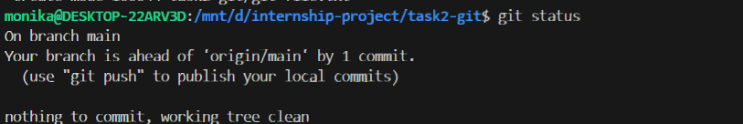

# Task 2: Git & GitHub Fundamentals

## 1. Git Config ✅
$ git config --list
remote.origin.url=https://github.com/monikaspawar/internship-project.git

## 2. Commands Executed
$ git init
$ git add .
$ git commit -m "Initial commit"
$ git checkout -b feature-branch
$ git merge feature-branch
$ git reset --hard HEAD~1

## 3. Key Concepts
- **.git folder**: Stores all commit history
- **git status**: Shows what's changed/staged  
- **Branches**: Parallel code versions
- **git reset**: Undo commits

## Screenshots

