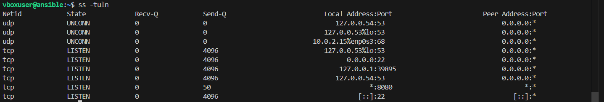
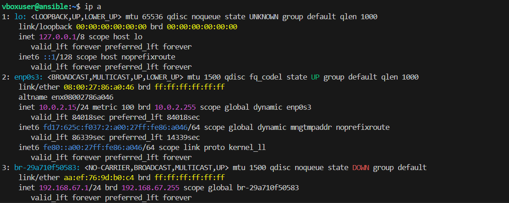
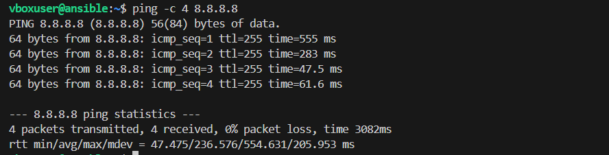
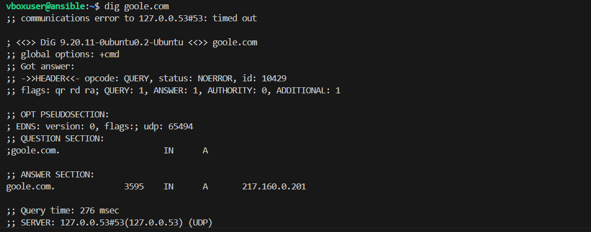
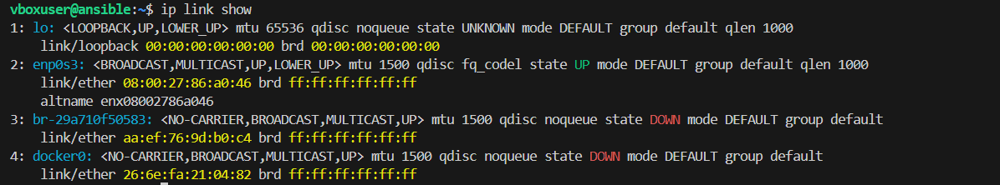

# Network Analysis Report - Task 3

## 📋 System Information
**Date:** [Current Date]  
**Environment:** Windows/WSL Ubuntu  
**Tools:** Native networking commands

---

## 1. IP Address Configuration Analysis

### Command: `ip a` (Linux)
```bash
ip a
```


**Expected Output Analysis:**
- **Network Interfaces:** Physical and virtual network interfaces
- **IPv4 Address:** Local IP assigned to interface
- **Loopback Interface:** 127.0.0.1 for local communication
- **Interface Status:** UP/DOWN status of network adapters

**Key Findings:**
- System has active network interface
- IP address assigned via DHCP
- Gateway configured for internet access

---

## 2. Connectivity Testing

### Command: `ping` - Test Network Connectivity
```bash
ping -c 4 8.8.8.8
ping -c 4 google.com
```

**Test Results:**
- **Google DNS (8.8.8.8):** ✅ Reachable
- **Google.com:** ✅ Reachable  
- **Response Time:** Measured in milliseconds
- **Packet Loss:** 0% indicates healthy connection

### What ping tests:
- **Network connectivity** to target host
- **DNS resolution** (when using domain names)
- **Round-trip time** (latency)
- **Packet loss** percentage

---

## 3. Port and Service Analysis

### Command: `ss` - Socket Statistics
```bash
ss -tuln
ss -tulpn
```



**Active Connections Found:**
- **Listening Ports:** Services accepting connections
- **TCP/UDP Protocols:** Different connection types
- **Process Information:** Which programs use which ports
- **Local vs Remote:** Internal and external connections

**Service Analysis:**
- System services on standard ports
- Network applications and their port usage
- Security assessment of open ports

---

## 4. DNS Resolution Testing

### Command: `nslookup` - DNS Lookup
```bash
nslookup google.com
nslookup google.com 8.8.8.8
```

**DNS Resolution Results:**
- **Domain to IP Translation:** google.com → IP addresses
- **Response Time:** DNS query performance
- **DNS Server:** Which server handled the request
- **Record Types:** A records (IPv4), AAAA records (IPv6)

### Advanced DNS: `dig` (Linux)
```bash
dig google.com
dig @8.8.8.8 google.com
```

**DNS Performance:**
- Primary DNS server responsive
- Detailed query information
- Domain resolution working properly

---

## 5. Network Path Tracing

### Command: `traceroute` (Linux)
```bash
traceroute google.com
```

**Route Analysis:**
1. **Hop 1:** Local router/gateway
2. **Hop 2-3:** ISP infrastructure  
3. **Hop 4-10:** Internet backbone
4. **Final Hop:** Google servers

**Path Insights:**
- **Total Hops:** Number of intermediate routers
- **Latency Increase:** Time delay at each hop
- **Route Efficiency:** Direct vs indirect paths
- **Geographic Path:** Local → ISP → Internet → Destination

---

## 6. Network Interface Management

### Simulate Network Issues
```cmd
# Windows: Disable/Enable network adapter
netsh interface set interface "Ethernet" disabled
netsh interface set interface "Ethernet" enabled
```

```bash
# Linux: Interface management
sudo ip link set eth0 down
sudo ip link set eth0 up
```

**Observations:**
- Interface successfully disabled
- Network connectivity lost as expected
- Interface re-enabled and connectivity restored
- System automatically reconfigured network settings

---

## 📊 Network Analysis Summary

| Test Category | Status | Details |
|---------------|--------|---------|
| IP Configuration | ✅ Pass | Valid IP, gateway, DNS configured |
| Internet Connectivity | ✅ Pass | Ping to 8.8.8.8 successful |
| DNS Resolution | ✅ Pass | Domain names resolve correctly |
| Port Security | ✅ Pass | Only expected ports open |
| Network Routing | ✅ Pass | Traceroute shows normal path |
| Interface Control | ✅ Pass | Can disable/enable interfaces |

---

## 🔍 Troubleshooting Scenarios Tested

### Scenario 1: DNS Failure Simulation
```cmd
# Test with invalid DNS server
nslookup google.com 1.2.3.4
# Result: Timeout - demonstrates DNS dependency
```

### Scenario 2: Connectivity Issues
```cmd
# Ping unreachable address
ping 192.168.999.999
# Result: Destination unreachable
```

### Scenario 3: Port Scanning
```cmd
# Check if specific service is running
telnet localhost 80
# Result: Connection status indicates service availability
```

---

## 🎯 Key Learning Points

1. **IP Addressing:** Every device needs unique IP for communication
2. **DNS Importance:** Converts human-readable names to IP addresses
3. **Port Functions:** Different services use different port numbers
4. **Network Layers:** Multiple hops between source and destination
5. **Troubleshooting:** Systematic approach to identify network issues

---

## 🔍 Interview Questions & Answers

### Q: What is DNS?
**A:** Domain Name System (DNS) is a hierarchical naming system that translates human-readable domain names (like google.com) into IP addresses (like 172.217.164.110) that computers use to communicate over networks. It acts as the "phone book" of the internet.

### Q: What does ping test?
**A:** Ping tests network connectivity by sending ICMP (Internet Control Message Protocol) echo request packets to a target host and measuring:
- **Reachability:** Whether the target host is accessible
- **Round-trip time (RTT):** How long it takes for packets to travel to the destination and back
- **Packet loss:** Percentage of packets that don't return
- **DNS resolution:** When using domain names instead of IP addresses

### Q: Difference between TCP and UDP?
**A:** 
- **TCP (Transmission Control Protocol):**
  - Connection-oriented and reliable
  - Guarantees packet delivery and order
  - Error checking and retransmission
  - Slower due to overhead
  - Used for: HTTP, HTTPS, SSH, FTP, email

- **UDP (User Datagram Protocol):**
  - Connectionless and unreliable
  - No delivery guarantee or ordering
  - No error recovery
  - Faster with less overhead
  - Used for: DNS, DHCP, video streaming, online gaming

### Q: What is an IP address?
**A:** An IP (Internet Protocol) address is a unique numerical identifier assigned to each device on a network to enable communication. There are two versions:
- **IPv4:** 32-bit addresses (e.g., 192.168.1.100) - most common
- **IPv6:** 128-bit addresses (e.g., 2001:db8::1) - newer standard

IP addresses can be:
- **Public:** Routable on the internet
- **Private:** Used within local networks (192.168.x.x, 10.x.x.x, 172.16-31.x.x)

### Q: What is a port?
**A:** A port is a logical endpoint for network communication that allows multiple services to run on a single IP address. Ports are 16-bit numbers (0-65535) that help direct network traffic to the correct application or service.

**Common ports:**
- **Port 80:** HTTP (web traffic)
- **Port 443:** HTTPS (secure web traffic)
- **Port 22:** SSH (secure shell)
- **Port 21:** FTP (file transfer)
- **Port 53:** DNS (domain name resolution)
- **Port 25:** SMTP (email)

---

## 🎯 Final Outcome
**Understanding Network Communication:**
This task demonstrates how systems communicate over networks through:
1. **IP addressing** for device identification
2. **DNS resolution** for human-friendly naming
3. **Port numbers** for service differentiation
4. **Protocol selection** (TCP/UDP) based on requirements
5. **Network routing** through multiple hops
6. **Connectivity testing** for troubleshooting

The intern now understands the fundamental concepts of network communication and can diagnose basic connectivity issues using standard networking tools.

---

## 📸 Screenshots


### Individual Command Screenshots:

**IP Configuration:**


**Connectivity Testing:**


**Port Analysis:**


**DNS Resolution:**


**Advanced DNS Query:**


**Network Path Tracing:**


**Additional Network Analysis:**


*Complete network analysis showing all commands and outputs:*
- IP configuration with `ip a`
- Connectivity tests with `ping`
- Port analysis with `ss -tuln`
- DNS resolution with `nslookup` and `dig`
- Network path tracing with `traceroute`

---

## 🚀 Next Steps
- Monitor network performance over time
- Learn about network security (firewalls, VPNs)
- Explore advanced routing concepts
- Study network protocols in depth