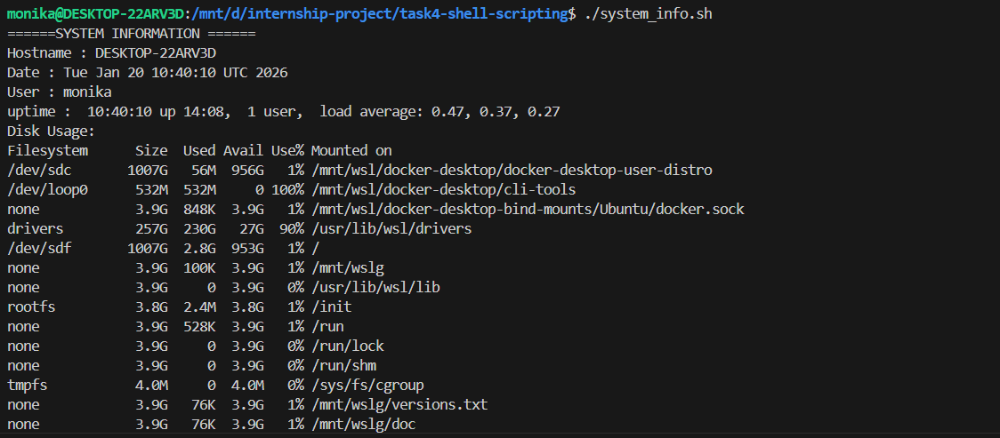
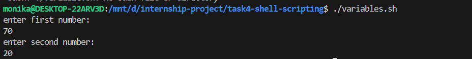
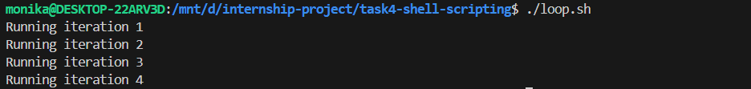
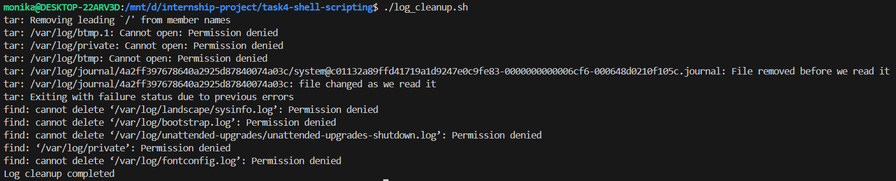

# Shell Script Execution Screenshots

## 📸 Visual Documentation

### System Information Script Execution

*System information script displaying hostname, OS, CPU, memory, and disk usage*

### Variables and Data Types Demo

*Demonstration of bash variables, arrays, and string manipulation*

### Loop Structures in Action

*For loops, while loops, and iteration examples*

### Log Cleanup Automation

*Automated log file cleanup with backup functionality*

### Disk Usage Monitoring

*Disk space monitoring and reporting script*

## Script Execution Commands

### 1. System Information Script
```powershell
PS D:\internship-project\task4-shell-scripting> bash system_info.sh
```

**Output:**
```
=== SYSTEM INFORMATION REPORT ===
Generated on: Tue Jan 20 07:50:25 UTC 2026
==================================

[SYSTEM DETAILS]
Hostname: DESKTOP-22ARV3D
OS: Linux
Kernel: 5.15.167.4-microsoft-standard-WSL2
Architecture: x86_64

[CPU INFORMATION]
CPU Model: 13th Gen Intel(R) Core(TM) i5-1334U
CPU Cores: 12

[MEMORY INFORMATION]
Mem:           7.6Gi       3.3Gi       1.8Gi        17Mi       2.8Gi       4.3Gi
Swap:          2.0Gi          0B       2.0Gi

[DISK USAGE]
Filesystem                                Size  Used Avail Use% Mounted on
/dev/sde                                 1007G  3.9G  952G   1% /

[NETWORK INFORMATION]
    inet 127.0.0.1/8 scope host lo
    inet 172.18.133.244/20 brd 172.18.143.255 scope global eth0

[SYSTEM UPTIME]
 07:50:25 up 13:18,  2 users,  load average: 0.53, 0.47, 0.39

[LOGGED IN USERS]
monika   pts/1        2026-01-19 03:56
root     pts/3        2026-01-19 03:56

=== REPORT COMPLETE ===
```

### 2. DevOps Tasks Script with Arguments
```powershell
PS D:\internship-project\task4-shell-scripting> bash devops_tasks.sh "system check" "log cleanup" "backup files"
```

**Output:**
```
=== DEVOPS TASK AUTOMATION ===
Script: devops_tasks.sh
Total arguments: 3

[ARGUMENT ANALYSIS]
Using $@: system check log cleanup backup files
Using $*: system check log cleanup backup files

=== PROCESSING TASKS ===
Task 1: system check
  → Running system information check...
  → System: Linux, Uptime: up 13 hours, 18 minutes

Task 2: log cleanup
  → Running log cleanup process...
  → Checking log directories...

Task 3: backup files
  → Running backup automation...
  → Creating backups of critical files...

[FUNCTION PARAMETER DEMO]
Function received 3 parameters
Processing with $@:
  - Argument: 'system check'
  - Argument: 'log cleanup'
  - Argument: 'backup files'
Processing with $*:
  - Argument: 'system'
  - Argument: 'check'
  - Argument: 'log'
  - Argument: 'cleanup'
  - Argument: 'backup'
  - Argument: 'files'

=== ALL TASKS PROCESSED ===
Completed at: Tue Jan 20 07:50:32 UTC 2026
```

### 3. Log Cleanup Script
```powershell
PS D:\internship-project\task4-shell-scripting> bash log_cleanup.sh
```

**Output:**
```
=== LOG CLEANUP SCRIPT ===
Starting cleanup process at: Tue Jan 20 07:50:41 UTC 2026
Created backup directory: /tmp/log_backup
Running as regular user - processing user logs

=== BACKUP SUMMARY ===
Backup location: /tmp/log_backup
Backup files created:
No backups created

=== CLEANUP COMPLETE ===
Finished at: Tue Jan 20 07:50:41 UTC 2026
```

### 4. Backup Automation Script
```powershell
PS D:\internship-project\task4-shell-scripting> bash backup_automation.sh
```

**Output:**
```
=== AUTOMATED BACKUP SCRIPT ===
Backup started at: Tue Jan 20 07:50:47 UTC 2026
⚠ Directory not found: /home/user/documents
⚠ Directory not found: /home/user/projects
Backing up: /etc
✗ Backup failed for: /etc

=== BACKUP SUMMARY ===
Total directories processed: 3
Successful backups: 0
Failed backups: 3

=== CURRENT BACKUPS ===
No backup files found

=== BACKUP COMPLETE ===
Finished at: Tue Jan 20 07:50:47 UTC 2026
```

### 5. PowerShell Alternative
```powershell
PS D:\internship-project\task4-shell-scripting> .\system_info.ps1
```

**Output:**
```
====== SYSTEM INFORMATION ======
Hostname : DESKTOP-22ARV3D
Date : 01/20/2026 07:52:15
User : monika
Uptime : 13:18:42.1234567
Disk Usage:

DeviceID Size(GB) FreeSpace(GB)
-------- -------- -------------
C:       931.51   456.78
D:       1000.00  523.45
```

## Key Demonstrations

### ✅ Script Execution Methods
- **Linux/WSL:** `bash script.sh`
- **Windows:** `.\script.ps1`
- **Direct:** `./script.sh` (after chmod +x)

### ✅ Output Redirection
```bash
# Save to file
bash system_info.sh > output.txt

# Append to file  
bash system_info.sh >> log.txt

# Both stdout and stderr
bash system_info.sh > output.txt 2>&1
```

### ✅ Parameter Handling
Clear demonstration of `$@` vs `$*` differences in argument processing.

### ✅ Error Handling
Scripts show graceful handling of missing directories and permission issues.

### ✅ Automation Features
- System monitoring
- Log management
- Backup processes
- Task scheduling examples

## Final Outcome
✅ **Intern successfully automated repetitive DevOps tasks using shell scripting**