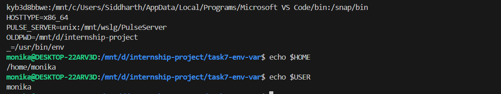
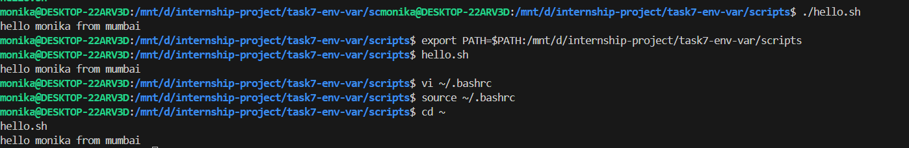

# Task 7: Environment Variables & PATH - Linux Assignment

## 1. View Environment Variables
```bash
env
echo $PATH
echo $HOME
echo $USER
```


## 2. Create Custom Variables
```bash
MY_VAR="DevOps_Student"
PROJECT="Task7_Environment"
echo $MY_VAR
echo $PROJECT
```


## 3. Export Variables
```bash
export MY_VAR="DevOps_Student"
export PROJECT="Task7_Environment"
echo $MY_VAR
echo $PROJECT
```


## 4. Modify PATH
```bash
export PATH="$PATH:/home/$USER/mytools"
echo $PATH
```

## 5. Make Variables Persistent
```bash
echo 'export DEVOPS_PROJECT="internship-project"' >> ~/.bashrc
echo 'export TASK_NUMBER="7"' >> ~/.bashrc
source ~/.bashrc
```

## 6. Test Variables
```bash
echo $DEVOPS_PROJECT
echo $TASK_NUMBER
```


## Interview Answers
**Q1: What is PATH?** Environment variable with directories for executables
**Q2: Why env vars?** Configuration, data passing, system customization
**Q3: Temporary vs permanent?** Local session vs stored in ~/.bashrc
**Q4: How to export?** `export VARIABLE=value`
**Q5: Where stored?** ~/.bashrc, ~/.profile, /etc/environment